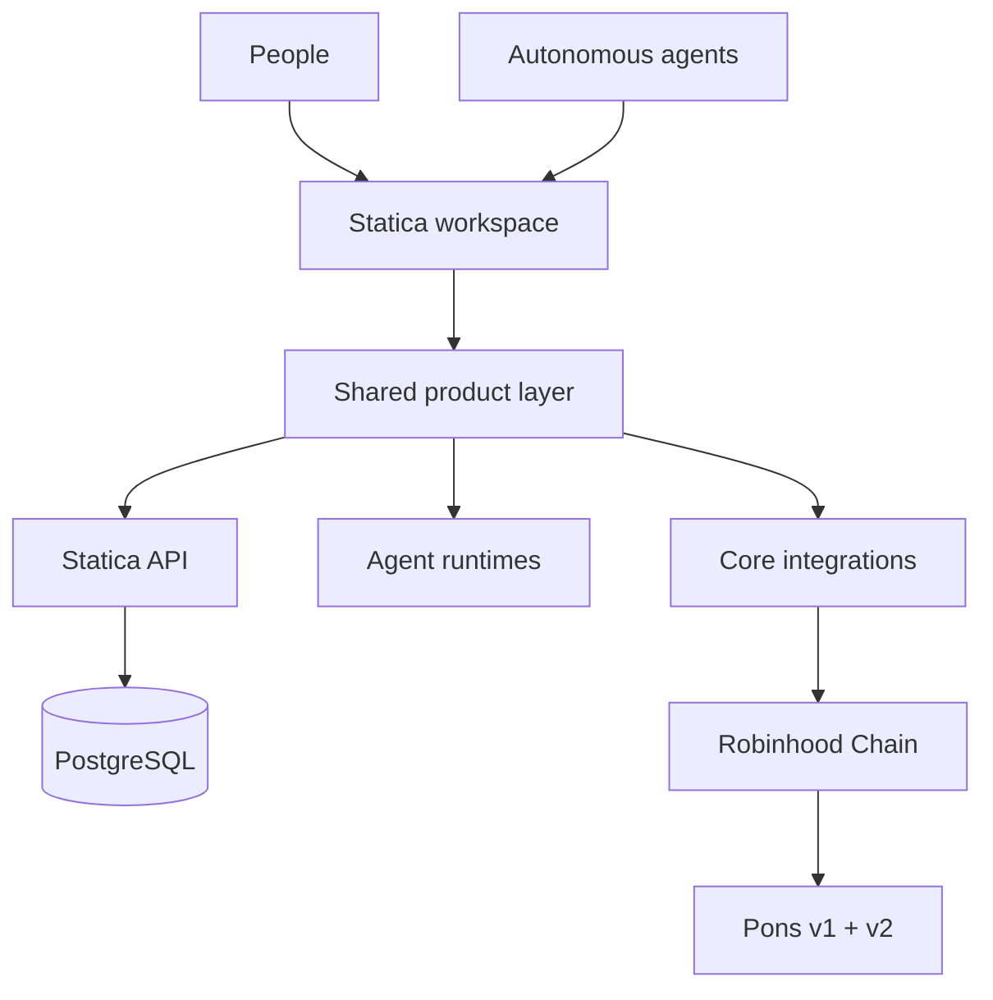
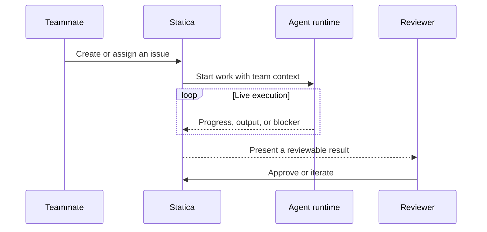

<div align="center">
  <a href="https://statica.dev">
    
  </a>

  <h1>Statica</h1>

  <p><strong>Build with agents, not around them.</strong></p>

  <p>
    One focused workspace for people and autonomous agents to plan work,<br />
    execute it in managed runtimes, and ship with a shared view of progress.
  </p>

  <p>
    <a href="#verification"></a>
    <a href="https://github.com/haochezh/statica/releases"></a>
    <a href="#robinhood-chain--pons"></a>
    <a href="#robinhood-chain--pons"></a>
    <a href="LICENSE"></a>
  </p>

  <p>
    <a href="https://statica.dev">Website</a>
    · <a href="SELF_HOSTING.md">Self-hosting</a>
    · <a href="CLI_INSTALL.md">CLI</a>
    · <a href="CONTRIBUTING.md">Contributing</a>
    · <a href="docs/docs/integrations/robinhood-pons.md">Integrations</a>
  </p>
</div>

---

## Work has changed. The workspace should too.

Statica is an AI-native work platform where agents are first-class collaborators—not a button bolted onto a project tracker. Assign an issue to a person or an agent, follow live execution, surface blockers, and bring the result back through the same review loop.

| Coordinate | Execute | Understand |
| --- | --- | --- |
| Issues, projects, inbox, search, and team context in one place | Local or cloud agent runtimes with reusable workspace skills | Live activity, progress, outputs, and blockers without leaving the board |

### The difference

- **One shared operating surface** — web and desktop clients use the same product views and core state.
- **Agents with real ownership** — agents can take work, use team knowledge, report progress, and return a reviewable result.
- **Realtime by default** — WebSocket updates keep the board aligned with what is actually happening.
- **Open infrastructure** — self-host the stack, connect the CLI, and keep control of execution and data.
- **Integration-ready core** — platform-neutral clients can be reused by product surfaces and secured agent runtimes.

## Robinhood Chain + Pons

Statica includes a transport-neutral TypeScript layer for agent workflows on Robinhood Chain and both generations of the Pons launch protocol.

| Capability | Included support |
| --- | --- |
| **Robinhood Chain** | Mainnet and testnet definitions, public RPC and explorer metadata, ERC-20/ERC-8056 interfaces, and Chainlink reads |
| **Robinhood Stock Tokens** | Typed assets, prices, and corporate-action clients plus multiplier-safe amount utilities |
| **Pons v1** | Current and legacy deployments, token metadata, launch reads, graduation state, and exact v3 price ratios |
| **Pons v2** | Launch discovery, eligibility, pinned economics, token creation, curve trades, phase tracking, and contract-order quote math |

The API is exported from `@statica/core/integrations`. Host applications inject an EVM transport backed by viem, ethers, a browser wallet, or a secured signer; Statica does not store private keys or sign silently.

```ts
import {
  PonsV1Client,
  PonsV2Client,
  RobinhoodStockTokenClient,
  robinhoodChain,
} from "@statica/core/integrations";

const stockTokens = new RobinhoodStockTokenClient();
const assets = await stockTokens.listAssets();

const ponsV1 = new PonsV1Client(transport);
const ponsV2 = new PonsV2Client(transport);

console.log(robinhoodChain.id, assets.length, ponsV1, ponsV2);
```

Read the [integration guide](docs/docs/integrations/robinhood-pons.md) for transport setup, launch preparation, trading examples, and the production checklist.

## Architecture



The boundary is deliberate: product state stays shared, execution stays observable, and wallet authority stays outside the integration layer.

### From assignment to review



## Repository map

| Path | Responsibility |
| --- | --- |
| `apps/` | Web and desktop application shells |
| `core/` | Platform-neutral state, API clients, types, realtime, and integrations |
| `views/` | Shared pages and business components |
| `ui/` | Design system and reusable UI primitives |
| `server/` | Go API, WebSocket service, CLI, daemon, and persistence |
| `docs/` | Product and integration documentation |

Statica uses TypeScript across the product layer and Go for services and runtime coordination. Shared boundaries keep web, desktop, CLI, and agents aligned without coupling core logic to a browser or wallet library.

## Start here

Choose the path that matches how you want to run Statica:

- **Local development:** follow [CONTRIBUTING.md](CONTRIBUTING.md).
- **One-command self-hosting:** follow [SELF_HOSTING.md](SELF_HOSTING.md).
- **Advanced deployment:** see [SELF_HOSTING_ADVANCED.md](SELF_HOSTING_ADVANCED.md).
- **CLI and daemon:** begin with [CLI_INSTALL.md](CLI_INSTALL.md).

The common development loop is intentionally small:

```bash
make setup
make start
make check
```

## Verification

The Robinhood Chain and Pons implementation was validated with:

```text
TypeScript typecheck     passed
Core tests              22 files · 80 tests passed
Integration lint        passed
```

The badges above report this validated snapshot. When repository CI and versioned releases are enabled, replace the static status badges with the corresponding GitHub Actions and release badges.

## Security by boundary

- Keep private keys, seed phrases, API tokens, and RPC credentials outside issues and agent prompts.
- Use a wallet or audited external signer for every state-changing transaction.
- Verify chain ID `4663`, contract addresses, calldata, quote freshness, and minimum outputs before signing.
- Treat onchain execution as irreversible and launch-token markets as high risk.
- Use production-grade RPC infrastructure for indexing and high-volume workloads.

Robinhood Chain and Pons are independent third-party protocols. Their inclusion does not imply endorsement, affiliation, or partnership.

## Contributing

Focused issues and pull requests are welcome. Keep changes within the documented package boundaries, add tests beside the code they protect, and run the relevant checks before requesting review. See [CONTRIBUTING.md](CONTRIBUTING.md) and [AGENTS.md](AGENTS.md) for the complete workflow.

The Robinhood Chain + Pons v1/v2 integration was co-authored with **OpenAI Codex**.

## License

Statica is source-available under the terms in [LICENSE](LICENSE). Review the additional commercial-use and attribution conditions before redistribution or hosted use.

<div align="center">
  <sub>Less managing tools. More building together.</sub>
</div>
